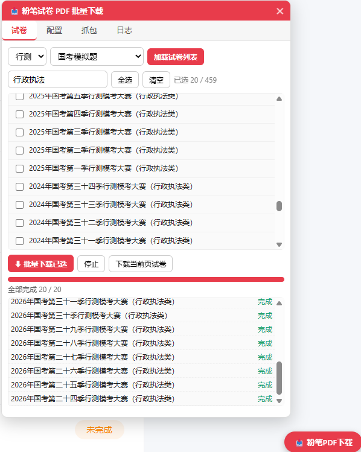

<div align="center">

<h1>申论批改工作区（shenlun-judge）</h1>

**一个人的申论训练台**：真题原文 ＋ 本人作答 ＋ 机构参考答案 ＋ 该卷批改规范 ＋ 批改报告 ＋ 一套写进 skill 的评卷口径。

[](LICENSE)
[](https://github.com/ye0619/Shenlun-SKILL)
[](https://github.com/ye0619/Shenlun-SKILL)
[](https://github.com/ye0619/Shenlun-SKILL)

</div>

> **定位提示**：这是**个人训练工具**，不是考试评分系统。所有分数都是"模拟阅卷模型"的输出，
> **不代表官方评分细则**（详见《免责声明》一节）。

---

## 目录

- [作者自述：这个 skill 是怎么来的](#作者自述这个-skill-是怎么来的)
- [项目结构](#项目结构)
- [批改效果](#批改效果)
- [快速开始](#快速开始)
  - [一键安装（npx）](#一键安装npx)
  - [克隆仓库手动使用](#克隆仓库手动使用)
  - [建议采用与本项目相同的结构](#建议采用与本项目相同的结构)
- [怎么用这个 skill 批改](#怎么用这个-skill-批改)
- [省 token 的实用技巧](#省-token-的实用技巧)
- [配套插件：粉笔试卷批量下载（配合篡改猴使用）](#配套插件粉笔试卷批量下载配合篡改猴使用)
- [目录与命名规范](#目录与命名规范)
- [评分口径：这套 skill 到底怎么打分](#评分口径这套-skill-到底怎么打分)
  - [依据层级（一切标注的根）](#依据层级一切标注的根)
  - [批改前六步（每次批改都做）](#批改前六步每次批改都做)
  - [两阶段流程：先试批改标定，再批改你的答卷](#两阶段流程先试批改标定再批改你的答卷2026-09)
  - [小题（归纳概括／综合分析／提出对策）：按语义采分点给分](#小题归纳概括综合分析提出对策按语义采分点给分)
  - [公文／应用文：先做五项检查，再按点赋分](#公文应用文先做五项检查再按点赋分)
  - [大作文：档位锚定、硬伤修正与档内定位（上／中／下）（四步）](#大作文档位锚定硬伤修正与档内定位上中下四步)
  - [字数：评分口径与统计口径必须分开](#字数评分口径与统计口径必须分开)
  - [输出与落盘](#输出与落盘)
- [移植到 Codex、Claude 等平台](#移植到-codexclaude-等平台)
  - [通用移植三步](#通用移植三步)
  - [各平台的差异与注意事项](#各平台的差异与注意事项)
  - [移植时必须保留的五条硬约束（否则 skill 会退化）](#移植时必须保留的五条硬约束否则-skill-会退化)
  - [脚本依赖](#脚本依赖)
- [这套 skill 的不足](#这套-skill-的不足)
- [免责声明](#免责声明)
- [反馈与改进](#反馈与改进)
- [附录：引用说明](#附录引用说明)

---

## 作者自述：这个 skill 是怎么来的

该申论批改 SKILL 主要用于个人学习，具有较强的针对性，所以实际使用效果见仁见智。关于小题，主要运用的方式是"采点给分"，得益于大模型超强的文本理解能力，我在使用 ds v4 生成的小题答案同机构答案相差无几，此外我还搜集了一些机构的参考答案用于对比，目前来看对于小题的评分可信度还是很高的。

对于大作文，我曾经也听过不少网课，很多老师会根据题目将作文分成某种类型，但我在听 b 站小马哥关于大作文的课时，他以 18 年地市作文"试谈有与无"为例，尽管题目是"有与无"并列，但论述重心应该放在"无"上。我对他的看法还是很认可的，所以在我的 SKILL 中添加了很重要的一条"反模板原则"。

但它目前对大作文的评判还是有一定问题，我自己的作文都是被评为二类，我个人认为还算中肯。不过一些机构作文也是二类，它批改的大作文有一重要的原因是材料例子引用较少/联系实际较少，我对其进行一定修改，但具体结果还待检验。

为了加强 SKILL 大作文批改可信度，我在工作区又新建了"批改规范"文件夹，你可自由将你搜集到的批改规范放入该文件夹，SKILL 会自动调用。

---

## 项目结构

```text
shenlun/
├── .dsh/skills/shenlun-judge/     # skill 本体：SKILL.md + references/*.md（含 essay-exemplars.md 范文梯队刻度）
├── 真题/                           # 试卷原题 PDF（题面与材料的最高依据 L1）+ 真题库，按省份分类，卷ID 命名
│   ├── {省份}/{卷ID}.pdf           # 原卷 PDF，如 河南/2022河南乡镇.pdf
│   ├── {省份}/真题库/{卷ID}.md      # 已入库真题（题面 + 库内评分依据）
│   ├── {省份}/真题库/INDEX.md       # 真题库索引（助手维护）
│   ├── _TEMPLATE.md                # 真题入库模板（新卷按它写成 {卷ID}.md）
│   └── README.md                   # 该目录用途与命名说明
├── 参考答案/                       # 机构/真题参考答案（L4 经验校准材料，非官方），按省份分类，卷ID 命名
│   ├── {省份}/{卷ID}/第N题.txt      # 一题一文件，如 河南/2026河南县级/第1题.txt
│   └── README.md                   # 来源与年份登记表
├── 作答记录/                       # 你自己的作答（只收 md / txt），按省份分类，卷ID 命名
│   ├── {省份}/{卷ID}.txt            # 一卷一份；改稿追加 -v2、-v3，不覆盖旧稿
│   └── README.md
├── 批改报告/                       # 批改报告落盘（md + .字数核验/ 留痕），按省份分类，卷ID 命名
│   ├── {省份}/{卷ID}-批改报告.md    # 报告母本（多稿 -v2 / -v3 追加）
│   ├── .字数核验/                   # 示例答案／范文的字数核验留痕（可复核）
│   ├── .采分点共识/                 # 小题采分点共识表缓存，可复用
│   ├── .大作文刻度/                 # 大作文梯队刻度缓存
│   └── README.md                   # 报告登记表（卷ID／版本／日期／得分／置信度／主要变化）
├── 批改规范/                       # 某卷（尤其大作文）的批改规范，按省份分类，卷ID 命名
│   ├── {省份}/{卷ID}-批改规范.md
│   ├── {省份}/{卷ID}-大作文批改规范.md
│   ├── _模板.md                    # 自拟批改规范的模板
│   └── README.md
├── 工具/                           # skill 的配套脚本（字数核验 / 同源检测），路径固定，勿改名或移动
│   ├── count_chars.py              # 字数核验（答题卡口径，标准库实现）
│   └── ref_independence.py         # 参考答案同源检测（判"几家独立"）
├── bin/install.js                  # npx 一键安装器（零依赖，装 skill + 配套脚本 + 生成五个材料目录）
├── templates/workspace/            # 安装时生成的五个材料目录 README 模板
├── fenbi-pdf-downloader.user.js    # 配套油猴脚本：粉笔试卷批量下载
├── package.json                    # npm 包定义（files 只含 skill 本体 + 工具/ + bin + templates）
└── README.md / LICENSE / .gitignore
```

> 上面的目录树只画结构与命名规范，**不含任何个人材料**（`作答记录/`、`批改报告/` 里的具体文件）与本地垃圾目录。

**各文件夹内容速查**

| 路径 | 作用 | 命名规范 |
|---|---|---|
| `作答记录/` | **你的作答**（批改对象）。整卷一份或按题拆分，**只收 md / txt** ｜**你**写进去 | `作答记录/{省份}/{卷ID}.txt` |
| `参考答案/` | **机构参考答案 / 真题参考答案**（L4 经验校准材料，非官方）｜**你**收集，助手登记 | `参考答案/{省份}/{卷ID}/第N题.txt` |
| `批改规范/` | **某套真题（尤其其大作文）的批改规范**——批改该卷时**有就必须引用**，大作文规范须逐条对照 ｜**你**收集 | `批改规范/{省份}/{卷ID}-批改规范.md`、`{卷ID}-大作文批改规范.md` |
| `批改报告/` | **批改报告母本（md）**，含逐题采分核对、档位、字数核验块；`批改报告/.字数核验/` 存字数核验留痕 ＋ `.采分点共识/` 存小题共识表 ＋ `.大作文刻度/` 存大作文梯队刻度 ｜**助手**自动落盘 | `批改报告/{省份}/{卷ID}-批改报告.md`（多稿 `-v2`） |
| `真题/` | **试卷原题 PDF（题面与材料的最高依据 L1）＋ 真题库** ｜**你**收集／**助手**入库 | `真题/{省份}/{卷ID}.pdf`、`真题/{省份}/真题库/{卷ID}.md` 与 `INDEX.md`（入库模板 `真题/_TEMPLATE.md`） |
| `.dsh/skills/shenlun-judge/` | **skill 本体**：`SKILL.md` 主工作流 ＋ `references/` 细则（含 `workspace-layout.md`）。**不含任何真题数据，也不含脚本**（脚本在工作区 `工具/`，见下一行）｜本工作区维护 | 目录名固定 |
| `工具/` | **skill 的配套脚本**：`count_chars.py`（字数核验）、`ref_independence.py`（参考答案同源检测）。随仓库发布，用 `npx` 安装器时也会一并放到工作区 `工具/` ｜本工作区维护 | 路径固定，**勿改名或移动**（skill 的文档按此路径调用） |
| `bin/install.js` | **npx 一键安装器**：把 skill 与两个配套脚本装进任意工作区，并生成五个材料目录与各自的 README（见《快速开始》）｜本工作区维护 | 文件名固定 |
| `templates/workspace/` | 安装时写进新工作区的**五个材料目录 README 模板**（已存在则不覆盖）｜本工作区维护 | 每个目录一个 `README.md` |
| `fenbi-pdf-downloader.user.js` | **配套油猴脚本**：粉笔试卷批量下载（见《配套插件：粉笔试卷批量下载》）｜本工作区维护 | 仓库根目录单文件 |
| `package.json` · `.gitignore` | npm 包定义（`files` 白名单只含 skill 本体、`工具/`、`bin/`、`templates/`）；`.gitignore` 排除个人材料与真题原卷（五个材料目录）以及 `.miktex/` 等本地垃圾，**不随仓库／npm 包发布** ｜本工作区维护 | 仓库根目录 |

**一键安装后你会得到什么**

1. `<工作区>/.dsh/skills/shenlun-judge/`——skill 本体（`SKILL.md` ＋ `references/`）；
2. `<工作区>/工具/`——**两个配套脚本** `count_chars.py`（字数核验）、`ref_independence.py`（参考答案同源检测）；
3. 五个材料目录 `真题/ 参考答案/ 作答记录/ 批改报告/ 批改规范/`；
4. 这五个目录**各自的 `README.md` 使用说明**（目录已存在则保留、README 已存在则不覆盖旧内容）。

---

## 批改效果

一份完整批改 = **对话里的精简报告** ＋ **落盘的 `批改报告/{省份}/{卷ID}-批改报告.md`**，
内容含**评分依据声明（L1–L4 ＋ 置信度）→ 逐题采分点核对（附原文证据）→ 建议区间与置信度 → 字数核验块 → 改进方向排序**。

<!-- ============ 手动粘贴区：批改效果（开始） ============ -->
> 📌 **示例批改报告**：见 [`批改报告/浙江/2018浙江A-批改报告.md`](批改报告/浙江/2018浙江A-批改报告.md)
> （也可直接把报告正文或截图粘在这一段里）。
>
> 注意：仓库克隆下来时 `批改报告/` 是空的（个人数据默认不入库），请以你本地的报告为准。

<!-- 图片示例：把图片放进 assets/ 目录后，取消下一行注释并改成真实文件名即可

-->

<!-- ============ 手动粘贴区：批改效果（结束） ============ -->

---

## 快速开始

### 一键安装（npx）

本仓库本身就是 skill 本体（`https://github.com/ye0619/Shenlun-SKILL`），自带一个**零依赖安装器**，一条命令即可装到任意工作区，不需要手动拷文件：

```bash
npx github:ye0619/Shenlun-SKILL          # 从 GitHub 直接装（当前可用）
npx shenlun-skill                        # 发布到 npm 后可用
npx shenlun-skill --dir "D:\my-ws"       # 装到指定工作区（默认：当前目录）
npx shenlun-skill --dry-run              # 只打印将要做的事，不写盘
npx shenlun-skill --force                # 清空并重建已存在的 skill 目录（清掉旧版本残留文件）
npx shenlun-skill --no-workspace         # 只装 skill，不创建五个材料目录
npx shenlun-skill --help                 # 用法说明（--version 看版本号）
```

- **装什么**：① `<工作区>/.dsh/skills/shenlun-judge/`——`SKILL.md` ＋ `references/`；
  ② `<工作区>/工具/`——两个配套脚本 `count_chars.py`、`ref_independence.py`；
  ③ 五个材料目录 `参考答案/ 作答记录/ 批改报告/ 批改规范/ 真题/`
  **及各自的 `README.md` 使用说明模板**（目录已存在则保留、README 已存在则不覆盖旧内容）。
- **包内只有 skill 本体 ＋ 配套脚本 `工具/` ＋ `bin/` ＋ `templates/`**（`package.json` 的 `files` 白名单），
  **不含任何个人材料与真题数据**：`参考答案/`、`作答记录/`、`批改报告/`、`批改规范/`、`真题/`
  与 `.miktex/` 均被 `.gitignore` 排除，**不会随仓库／npm 包发布**。
- 装好后在支持 skill 的平台里打开该工作区，直接说 `批改 2026河南县级` 即可。

### 克隆仓库手动使用

```bash
git clone https://github.com/ye0619/Shenlun-SKILL.git
```

- 把 `.dsh/skills/shenlun-judge/` 整个目录拷进你自己的工作区 `.dsh/skills/` 下（目录名随意），并把工作区 `工具/`（两个配套脚本）一并拷到目标工作区根目录；
  或者干脆**把这个仓库本身当工作区用**，材料直接往五个材料目录里放。
- **注意**：`.gitignore` 已排除 `真题/ 参考答案/ 作答记录/ 批改报告/ 批改规范/`，
  所以克隆下来这五个目录是**空的**，需要自己往里放材料（放法见《怎么用这个 skill 批改》与《目录与命名规范》）。
- 不想手动拷文件，就用上面的 npx 一键安装。

### 建议采用与本项目相同的结构

**采用和这个项目相同的目录结构与命名（`{省份}/{卷ID}`），效果会明显更好**，原因有三条：

1. **同名同结构才能一次命中**：助手按 `{省份}/{卷ID}` 去 `作答记录/` 找作答、去 `参考答案/` 找参考口径、
   去 `批改规范/` 找该卷规范、去 `批改报告/` 找历史报告；路径与文件名一致时，一次就能全部定位。
2. **命名一致才能自动归位与跨卷对比**：材料按规范名落位，报告才能自动登记进 `批改报告/README.md`，
   `-v2`／`-v3` 多稿才能横向比较，同省份跨年份的卷子也才能放在一起看趋势。
3. **结构不一致也不会崩，但要多花往返**：材料散落根目录、命名含糊（`申论.pdf`、`答案.txt`）时，
   助手仍会做归位与重命名，但会出现"找不到材料／需要反复向你确认"的额外消耗，token 和耐心都更费。

---

## 怎么用这个 skill 批改

**① 把材料放进工作区**（丢在工作区根目录就行，不用自己摆）

- 助手会在批改前自动识别**年份／省份／卷型／材料类型**，按 `{材料类型}/{省份}/{卷ID}…` 归位并重命名，
  并列出"原路径 → 新路径"清单让你核对；**命名含糊时**（`申论.pdf`、`答案.txt`、`新建文件夹`）会**先问你**，不自作主张。
- 想自己放，按这个来：
  - 作答 → `作答记录/{省份}/{卷ID}.txt`（**只收 md / txt**）。`作答记录/` **不收图片与扫描件**：
    检测到图片时助手会**请你自己先转成文本**（OCR 转写难免字误，而字误会直接影响采分点判定）；
    你明确说"先帮我转"才代为 OCR，并在报告里注明转写方式、附转写稿请你校对。
  - 参考答案 → `参考答案/{省份}/{卷ID}/第N题.txt`（如 `参考答案/河南/2026河南县级/第1题.txt`），
    并在 `参考答案/README.md` 登记来源与年份——**有该卷批改规范，或有来源独立、覆盖本题的参考口径，
    评分置信度才能到"高"**。
  - 该卷批改规范 → `批改规范/{省份}/`（`{卷ID}-批改规范.md` 或 `{卷ID}-大作文批改规范.md`）：
    助手批改该卷时**有就必须引用**，**大作文规范逐条对照**（层级按来源判定，见《评分口径》一节的"依据层级"）。
  - 真题原卷 → `真题/{省份}/{卷ID}.pdf`。

**② 发一句话指令**（越具体越准）

- `批改 2022河南乡镇`（助手自己去 `作答记录/` 找）
- `批改 .\作答记录\河南\2022河南乡镇.txt`（直接指到文件，最省事）
- `帮我批改这篇大作文，题目是"守正与创新"`（把文本贴在对话里）
- `这道归纳概括我踩到采分点了吗`
- `按这套卷的批改规范给我打分`
- `倡议书格式怎么写` ｜ `大作文立意和分论点怎么搞`
- `展开`（对最近一次批改给逐段细评）｜ `给我参考范文` ｜ `导出 word`

**③ 看报告**

- 先看**总分表与建议区间**，再看**每题的采分点核对**（哪些命中、哪些丢），
  最后按"改进方向"的第一条动手改——那是本次最值钱的一条。
- 小题请**先看"采分点共识表"（强共识点／弱共识点／单源点／材料推定点／争议点），再看分数**——
  它说明"这个点为什么算分、那个点为什么只是低权"；另有**提醒区**：
  材料里确实有、但**机构答案 0 家收录**的点，**本次不计分**，只作提示
  （L3 模拟口径，见《评分口径》一节）。
- 改完再批一次，会生成 `-v2`；`批改报告/README.md` 里的登记表能把多次批改横向对比。
- 默认只给**精简报告**：说"展开／详细"才给逐段逐句细评，要"参考范文"才出整篇示范。

---

## 省 token 的实用技巧

同样是批一套卷，喂法不同，token 差好几倍。下面几条按收益从高到低排：

| 技巧 | 说明 |
|---|---|
| **一律用 `.txt` / `.md`** | 同样内容，纯文本比 docx/pdf 省得多；`.docx` 还要额外解压提取 |
| **图像先自己转文字** | 手写稿、扫描件、长截图请自己敲成文本再放进来——比让模型 OCR 更省、更准（OCR 还可能带来影响采分判定的字误） |
| **材料放工作区，不贴进对话** | 题干/材料放 `真题/{省份}/…`，批改时说卷ID，助手按需读取，不把长材料灌进上下文 |
| **先给卷ID再批** | `批改 2022河南乡镇` 一次定位题干、参考答案、批改规范、历史报告；比"我贴一段你猜是哪套卷"省 |
| **一次一套卷或一题** | 一次丢五套卷＝让模型反复读五遍，分批最省 |
| **默认"精简"** | 报告默认精简；只有要逐段逐句细评、示范改写时才说"展开"，整篇范文单独要 |
| **善用已入库真题** | 常练的卷按 `真题/_TEMPLATE.md` 入库一次，之后省掉"重新解析 PDF、重新拆采分点" |
| **作答只放一次** | 放进 `作答记录/{省份}/{卷ID}.txt` 后说卷ID 即可，不要每轮重贴；改稿用 `-v2` 并存 |
| **参考答案整卷丢进去** | 把该卷参考答案都丢进 `参考答案/{省份}/{卷ID}/` 就行：助手会用 `ref_independence.py` 自动判"同源/独立"，你不用手工标注哪家是哪家，也不用在对话里解释 |
| **小题与大作文分开批** | 大作文最耗 token，可先批小题、再单独批大作文，不必每轮重跑全卷 |
| **大作文只建一次刻度** | 第一次用 `参考答案/` 里的范文 ＋ 你的历史批改建 **T1/T2 梯队**，之后每次批改**只读梯队画像**（几百字），不要每次重读范文；缓存见 `批改报告/.大作文刻度/`（L3/L4，非官方；单篇范文不成刻度，不必建） |
| **别贴超长聊天记录** | 只保留本次需要的题干、材料与作答片段 |

---

## 配套插件：粉笔试卷批量下载（配合篡改猴使用）

- **文件位置**：仓库根目录 `fenbi-pdf-downloader.user.js`（v1.4.0，单文件油猴脚本，约 1400 行）。
  > 注意：`npx` 只安装 skill 本体，**不含**这个脚本。要拿它请
  > [克隆仓库](https://github.com/ye0619/Shenlun-SKILL)（或在 GitHub 上打开该文件直接复制内容）。
- **作用**：登录粉笔网页版后**批量下载**行测／申论等试卷 PDF（历年真题、每日演练、模考等），
  下载到的 PDF 可以直接当作工作区的 `真题/{省份}/{卷ID}.pdf` 使用。
- **安装**：
  1. 给浏览器装 **Tampermonkey（篡改猴）** 扩展；
  2. 打开 Tampermonkey 面板 →「实用工具／添加新脚本」，把 `fenbi-pdf-downloader.user.js` 的内容粘进去保存
     （或把文件拖进浏览器，按提示安装）；
  3. 确认脚本处于**启用**状态。
- **使用**：先登录 `www.fenbi.com` → 页面右下角出现「📥 粉笔PDF下载」按钮 →
  选科目（行测／申论）与分类，勾选试卷后批量下载。
- **失效怎么办**：脚本接口按 2026-08 粉笔网页版抓包校准；若粉笔改版导致失败，
  用脚本内置的「抓包」标签页，在粉笔页面上正常浏览／下载一次，再点「从抓包记录生成配置」自适应。
- **提醒**：该脚本与粉笔官方无关，仅供个人学习与自用，请遵守平台条款与相关版权规定。

<!-- ============ 手动粘贴区：插件截图（开始） ============ -->

<!-- ============ 手动粘贴区：插件截图（结束） ============ -->

---

## 目录与命名规范

> **五个材料目录（`真题 / 参考答案 / 作答记录 / 批改报告 / 批改规范`）一律按省份分类**，
> 文件与文件夹**统一用"卷ID"命名**：**卷ID = `{四位年份}{省份}{卷型}`**
> （如 `2022河南乡镇`、`2026国考行政执法`、`2024浙江A`）。
> 同一卷的五个目录靠同一个卷ID串起来，完整规范见 skill 的 `references/workspace-layout.md`。

| 材料类型 | 规范路径 | 备注 |
|---|---|---|
| 作答 | `作答记录/{省份}/{卷ID}.txt` | **只收 md / txt**；整卷一份或按题拆分；改稿用 `-v2`、`-v3` |
| 参考答案 | `参考答案/{省份}/{卷ID}/第N题.txt` | 一题一文件（如 `参考答案/河南/2026河南县级/第1题.txt`），并在 `参考答案/README.md` 登记来源与年份 |
| 批改规范 | `批改规范/{省份}/{卷ID}-批改规范.md`、`{卷ID}-大作文批改规范.md` | 该卷有规范就放进来；批改该卷时**有就必须引用**，大作文规范逐条对照；层级按来源判定（见《评分口径》一节的"依据层级"）；自拟可用 `批改规范/_模板.md` |
| 真题原卷 | `真题/{省份}/{卷ID}.pdf` | 题面与材料的最高依据（L1）；助手按 PDF 提取，必要时人工校对 |
| 真题库 | `真题/{省份}/真题库/{卷ID}.md` ＋ `INDEX.md` | 入库一次即可复用；模板 `真题/_TEMPLATE.md` |
| 批改报告 | `批改报告/{省份}/{卷ID}-批改报告.md` | 助手自动落盘；`批改报告/.字数核验/` 留痕；登记表 `批改报告/README.md` |

- **命名含糊或年份／卷型冲突时，助手会先问你，绝不擅自猜**（归位与命名由"批改前六步"第一步统一处理，见《评分口径》）。
- 五个材料目录**已被 `.gitignore` 排除**，不随仓库／npm 包发布，克隆下来是空的。

---

## 评分口径：这套 skill 到底怎么打分

### 依据层级（一切标注的根）

| 层级 | 是什么 | 用法 |
|:--:|---|---|
| **L1** | **官方公开的考试要求与能力维度**：题面作答要求原文（"观点明确、见解深刻""不超过 300 字"）、大纲/公告公开的测查能力、考场硬规则（"超出答题区域的作答无效"） | **最高依据**，直接决定"这题考什么、必须做到什么" |
| **L2** | 官方公开的**赋分方式描述**："按点给分""划档赋分"、四维宏观措辞（立意深刻／内容充实／结构严谨／语言优美） | 作为框架使用 |
| **L3** | **本 skill 自建的模拟阅卷模型（经验口径）**：档位区间与换算、采分点拆分与分值、扣分量级、字数目标区 | 一律标注"模拟口径，官方细则未公开"，**不得说成官方规定** |
| **L4** | **经验校准**：`参考答案/` 里的机构解析、`批改规范/`（机构或自拟）、历史批改结果 | 只用于校准宽严与粒度，**与 L1 冲突以 L1 为准** |

> **`批改规范/` 的层级按来源判定**：该卷有批改规范（`批改规范/{省份}/{卷ID}-批改规范.md`
> 或 `{卷ID}-大作文批改规范.md`）时**有就必须引用**，**大作文规范逐条对照**——
> 来源为**官方公开**的评分标准／阅卷细则 → 视为 **L1/L2，优先于本 skill 的 L3 模拟口径**；
> 来源为**机构／个人自拟** → **L4 校准**，只调宽严与粒度；**来源不明不得当官方标准**。
> 与题面要求冲突时一律以题面（L1）为准；报告须登记文件名、来源、年份与层级判定。

### 批改前六步（每次批改都做）

> 顺序要点：**第 6 步"试批改标定"必须在真正批改之前做完**（真实阅卷也是先试批改、再定标尺）。

1. **材料归位与命名检查**：先扫一遍工作区根目录与五个材料目录，把散落材料按
   `{材料类型}/{省份}/{卷ID}…` 归位并改为规范名，并列出"原路径 → 新路径"清单（不静默改名）；
   **文件名含糊**（`申论.pdf`、`答案.txt`、`新建文件夹`）或年份／卷型冲突时**先问你，绝不擅自猜**。
   归位与命名规范见 skill 的 `references/workspace-layout.md`（唯一出处）。
2. **定位作答**：优先用对话里贴出的作答；否则去 `作答记录/{省份}/` 按卷ID找（多稿 `-v2`，
   命中多份会问你用哪一份）。找不到就**明说找不到**——不会替你猜作答内容，
   也不会拿参考答案冒充你的作答。
3. **引用批改规范**：查 `批改规范/{省份}/`。**该卷有规范就必须引用，大作文规范逐条对照**，
   并按来源登记层级（官方公开 → L1/L2，优先于本 skill 模拟口径；机构／自拟 → L4 校准）；
   没命中就明写"未找到该卷批改规范"。
4. **查参考答案**：按卷查 `参考答案/{省份}/{卷ID}/第N题.txt`。命中 → 登记文件名/来源/年份，
   用它校准同义表述宽严与采分点粒度；没命中 → 明写"未找到参考答案"，采分点改为纯模拟重构。
   **参考口径只是采样与校准，份数多不等于置信度高**（判定见本节"评分置信度：采样与校准口径"）。
5. **获取题面与给定资料（L1，必做）**：工作区根目录 PDF → `真题/{省份}/` → 联网搜索；
   都取不到必须声明"**题面未经核实、置信度低**"，只给档位级结论。
6. **试批改标定（阶段 A，必做）**：拿本题参考答案**自己试批改一遍**（逐份核对
   "命中／漏写／多写／表述方式／舍弃了什么"）→ 从**共同点／差异点／边界情况**生成
   本题《动态评分规范》（7 项，见《评分口径》一节的"两阶段流程"）→ **然后才批改你的答卷**。
   该题**无参考答案／仅 1 家／全同源／脚本不可用**时**不标定**，改用通用规则，
   并明确声明"**未做本题参考答案试批改**"、该题置信度上限"中"。
   （另注：`真题识别` 与 `真题/{省份}/真题库/INDEX.md` 的匹配仍照旧，属可选加速通道。）

### 两阶段流程：先试批改标定，再批改你的答卷（2026-09）

> 真实阅卷是"**先试批改 → 定标尺 → 再正式阅卷**"。本 skill 照此分两阶段，
> **口径唯一出处**：`references/small-questions.md` 第四节阶段 A。

**阶段 A｜评分标准标定（Calibration）**——批改你的答卷**之前**：

1. **不把参考答案当唯一标准答案**：拿参考答案**自己试批改一遍**——逐份核对五件事
   （①命中的点 ②漏写的点 ③多写/越界 ④表述方式 ⑤舍弃了什么）；
2. **交叉比较得三类结论**：**共同点**（≥2 家 → 核心采分点）／**差异点**（1 家 → 低权点；
   同义不同词 → "可接受的同义表达"清单）／**边界情况**（各家"多写少写"的分歧 →
   部分命中规则、**不应机械扣分的情况**）；
3. **生成本题《动态评分规范》（必须含 7 项）**：① 核心采分点 ② 可接受的同义表达
   ③ 部分命中规则 ④ **不应机械扣分的情况** ⑤ 材料使用要求 ⑥ 联系实际要求
   ⑦ 大作文档次锚点（引用梯队**参照档**）；落盘 `批改规范/{省份}/{卷ID}-第N题-动态评分规范.md`
   （大作文并入 `{卷ID}-大作文批改规范.md`），标"**助手对本题参考答案试批改提炼（L4 非官方）／
   待用户确认（草稿）**"；**试批改过程记录**写入
   `批改报告/.采分点共识/{卷ID}-第N题-共识表.md` 的「**试批改记录**」段。

**阶段 B｜用户答卷评分**：**用阶段 A 形成的规范**批改——先读《动态评分规范》逐条对照，
再按采分点共识模型定价、逐条语义核对给分。

**材料不足时**：不执行阶段 A、改用 L3 模拟机制，**并明确声明"未做试批改、依据为通用评分规则"**。

> ⚠ **禁止**：把参考答案当唯一标准答案；**跳过阶段 A 直接批改**（材料不足除外且必须声明）；
> 把《动态评分规范》说成"官方评分规范"；**用试批改给参考答案打分再折算你的分数**。

### 小题（归纳概括／综合分析／提出对策）：按**语义采分点**给分

- 采分点拆成三要素：**核心动作 ｜ 核心对象 ｜ 关键限定/结果**。
- 判定**只看语义命中程度**，**不设 80%/40% 覆盖率阈值**、不用文本相似度：
  三要素齐 → 该点满分；核心动作与对象命中但限定缺失 → 部分分；只有泛泛表述 → 低分或不得分；
  材料无依据（脑补）→ 0 分，**不额外倒扣**。
- **同义表达照给分（语义等价 ＋ 逻辑等价）**：你用自己的话把同一意思说清了，**一律按同一采分点给分**——
  参考答案写"科技赋能基层治理"、你写"利用数字技术降低治理成本、提升服务效率"，属语义等价，照给分。
  **禁止**"没出现那几个词就判偏离"，也**禁止**"与参考答案说法不同就扣分"。
- **所答即所判，无倒扣、无加分**；口语化不单独扣分。
- 采分点清单与子项分值属 **L3 模拟重构**（报告里注为"官方细则未公开"）。

**采分点共识模型（2026 修订，本版最重要的变化）**

小题采分点**先按 `参考答案/` 定来源等级，再给分**——来源等级只用来**定权重、定置信度**，
**不能用来排除材料确凿的点**。它治一个具体失真：**模型自己"发明"一个看着很重要、
但各家机构答案都没有的给分点**，再按不低的分值扣分。

| 来源等级 | 判定（家数＝**独立**来源家数） | 分值待遇 |
|---|---|---|
| **强共识点** | **≥3 家**，或 **2 家且占独立来源 ≥50%**，且材料有据 | **主池高值**；共识点合计占满分池 **70%–80%** |
| **弱共识点** | **恰好 2 家**且占独立来源 **<50%** | **主池低值**（高于任何单源点） |
| **单源点** | **恰好 1 家**命中，且材料有据 | **低权**，**单点分值不高于共识点** |
| **材料推定点**（**提醒项**） | **0 家**命中，但材料原文**确凿支持** | **不计分（0 分）、不占分母** → 单列"**提醒区**" |
| **争议点** | 各来源对同一材料得出**不同结论／不同归因** | **不计分、不占分母**，答任一方都算命中 |

**两条铁律**：① **材料原文依据是硬门槛**——每个采分点**必须给出材料原文出处**
（写成 `材料X第Y段"……"`），**拿不出就删除**，不进采分点表；② **参考答案是校准尺，不是判据；
但它决定"算不算分"**——机构集体漏点的材料确凿之点**必须照列**、但列为**提醒项不计分**
（**不得悄悄删掉**）；**也不拿它给用户算分**（机构集体没有的点大概率不在采分表里，
计分即失真）。**唯一例外**：该题参考资料本身不完整（疑为节选／**仅 1 家独立来源**／未做同源检测）→
提醒项**按低权计分、进入计分表**，报告标注、置信度按 0.4 判定（仅 1 家＝中；资料残缺＝低）。

**同源只算一家**：机构之间大量互相转抄，所以**独立来源家数 = 分组数，不是文件数**。
用 `工具/ref_independence.py` 对同一题的参考答案两两算文本重合率并分组：
`--same`（默认 **0.80**）同源转抄、`--near`（默认 **0.60**）疑似同源（保守同组）；
**只有 1 家、或全部同源 → 该题没有共识点**。
> 提示：**给分不用文本相似度**；`ref_independence.py` 的相似度**只用于参考答案之间判同源**。

**分值池纪律**：**分值池恒等于题目总分**——某点退出计分（**0 家收录**／争议点）时，
**其分值回补到剩下的计分点**（不得把题总分调低、也不得让满分拿不到）；
**共识点合计 70%–80%、低权点（单源点）20%–30%（目标区，硬上限 40%）、单点分值 10%–35%**；
**漏掉低权点只扣该点小分值，不得据此判定"内容不全面"或整体降档**；**提醒区更不影响得分**。
**例外**（参考资料残缺／仅 1 家独立来源）：提醒项按低权计分并进入计分表，
此时低权池 ＝ 单源点 ＋ 材料推定点，**不受 20%–30% 目标区与 40% 上限约束**。
**无共识点**（无参考答案／只有 1 家／全同源／脚本不可用）→ 整题退回**模拟重构（L3）**，
报告写明"本题无共识点，采分点为模拟重构（含低权保留）"；**置信度：仅 1 家＝中、资料残缺＝低**。

**逐点回退 ＋ 冲突分型**：回退必须**按点**进行（某点有来源 → 判共识／单源；没有 → 材料推定点），
**不是整题开关**；参考答案之间的"冲突"要分型看：

| 冲突形态 | 其实是 | 处理 |
|---|---|---|
| 同一意思、不同措辞 | **同义表达** | 合并为**同一个采分点**，多种表述并行接受 |
| 一家拆两点、另一家并一点 | **粒度差异** | 不是争议；**按任一种粒度写都算命中** |
| A 家有、B 家完全没有 | **漏点** | 归"单源点"低权，**不计为争议** |
| 对同一材料得出不同结论／归因 | **真争议点** | **双向接受、不据此单独扣分**，报告显式列出 |
| 某家答案本身错／跑偏／与本卷不符 | **正误分歧** | 按材料裁断，**错的一方整体不计入**来源统计 |

> 只有第 4 行才是"争议点"。**共识表缓存**：`批改报告/.采分点共识/{卷ID}-第N题-共识表.md`，
> 表头记录参与归并的参考答案**文件清单 ＋ 字节数 ＋ 修改时间**（**来源指纹**）；
> 同卷再批**直接复用**，**指纹变了就重建**。

**看报告时先看什么**：报告里会给出"**采分点共识表**"
（**点号｜要点｜材料原文依据｜独立来源家数｜来源等级｜分值**），
一眼看清"**这个点为什么算分、那个点为什么只是低权**"。

> 以上均属 **L3 模拟口径**（档位与采分点拆分，官方细则未公开）＋ **L4 经验校准**
> （工作区 `参考答案/`，非官方）——**不是官方规定**。

### 公文／应用文：**先做五项检查，再按点赋分**

1. **任务目的**是否完成（倡议／汇报／答复／推荐……）；2. **身份场景**是否对位（发文者、受众、场合、职权）；
3. **内容完整度**（材料核心信息覆盖、是否符合文种目的）；4. **格式规范性**（标题／称呼／正文／落款／日期；
   题目说"不考虑格式"则格式分归零）；5. **语言得体性**（上行／平行／下行语气）。
> 公开大纲从未公布"内容 X%／格式 X%／语言 X%"的分值表，所以 skill **不宣称任何官方比例**，
> 报告里的占比只是训练参照。
>
> **同义表达照给分**：要点判定同样看"**意思到没到、逻辑成不成立**"——与参考答案用词不同但
> 语义／逻辑等价的，**按同一要点给分**，不得因用词与参考答案不一致就判漏点、扣分。

### 大作文：**档位锚定、硬伤修正与档内定位（上／中／下）**（四步）

1. **第一步｜四维综合锚定大档**：题意、内容、结构、语言**四维各给判定＋原文证据**，再**综合锚定大档**
   （一类／二类／三类／四类，按满分占比：**≥80% ／ 60%–80% ／ 30%–60% ／ <30%**，边界点归上一档）——
   **不取最低档**、不数维度计票、不因单一维度偏弱整篇降档；综合理由要写明哪几维支撑本档、哪一维拖后腿。
   **形式不参与定档**（2026 修订，取代旧的"反模板铁律"名称；本 skill 评分纪律，非官方）：**结构维度的检查项只有**——
   **点题**（标题／首段／尾段至少两处可追溯）、**展开**（分论点或层次清晰、能支撑总论点、不重复）、
   **收束**（回扣与结尾完整）＋**层次是否分明、衔接是否顺畅**；**检查项里没有"是否符合某类型／
   某模板／某名师框架"**，所以不构成任何扣分理由——不按五段三分写不扣分，套模板也不加分。
   **判语黑名单（出现即作废）**：说了"不符合五段三分""归类困难按三类处理""套模板扣 X 分"
   （反向"用了某框架加分"同样作废）、"没出现×××这几个词判偏离""与参考答案角度不同扣分"
   "没引用材料某案例扣分""立意稍微模糊按二类封顶""不够深刻（却不点名层次）""与某篇范文相似加分"
   "某机构答案写了这点所以必须给分"，**该处判分一律作废并删除**。
   类型框架／结构套路（五段三分等）的合法身份只有两个：**审题辅助、构思脚手架**。
2. **第二步｜硬伤修正（只设上限，不加分）**：命中则对基础档位设**档位上限**，取命中项中**最严的一条**执行——
   明显跑题（通篇不涉及题干核心概念）→ 上限**四类**；偏题（只谈相邻概念／仅抓次要概念）／
   核心任务遗漏严重／论点与材料主旨明显冲突 → 上限**三类**；大面积无法辨认／严重语言障碍 → **下调一档**。
   **未命中硬伤就不降档**；上限之内的具体分数仍由第三步定出。
3. **第三步｜档内定位（上／中／下三小档）**：大档锚定后**取消"±1／±0.5 机械加减"**，
   改为在本大档内分**上、中、下三个小档**（各占大档区间的上／中／下三分之一），
   按**内容质量、论证深度、结构完成度、语言质量**四项的实际表现取该小档区间；
   **边界点归上一小档**，落分**不得越出本大档区间**（想越档是第一步的事，不是第三步的调节手段）。
   **亮点不单独加分**（不设"创新分"）：够上一档的水准，就在第一步把基础档位定上去。
4. **第四步｜区间与置信度（必给）**：主分之外必须给**建议区间**＋**评分置信度（高/中/低 + 理由）**；
   置信度不到"高"时**不输出"28.5 分"式伪精确结论**。

**"深刻"怎么判（L3 模拟口径 ＋ L4 经验校准，非官方）**

- **先承认**：**"深刻"没有官方统一标准**，它只是题面"见解深刻／观点独到"这类**公开作答要求（L1）**
  的定性描述，**不是一个可独立打分的维度**。
- **三个来源**：① **因果链**（回答"为什么会这样／根子在哪"）② **边界条件**（条件、限度、分寸、转化；
  **不绝对化**）③ **一般化**（把具体案例上升为**有适用范围的判断**）；可选第四个：④ **纠正默认预期**
  （抓住题干被忽略的一侧，如"有与无"重心落在"无"）。
- **四级刻度**：**复述型**（把材料换个说法）→ 三类；**明理型**（是什么 ＋ 为什么，1 层因果）→ 二类；
  **见地理型**（上升到一般判断、点出边界）→ 一类下／中；**洞见型**（纠正默认预期 ＋ 结构性解释 ＋
  落到具体机制）→ 一类上。**不单独加分**，只在**题意维度**（及其对论证深度的联动）里体现。
- **三条边界（2026-09 修订）**：**① 题面许可原则（改口径）**——题面**没写**"见解深刻／观点独到"时，
  深度**仍然参与题意判定**（立意有没有想透），只是**不得仅凭"文采一般／不够玄妙"扣分**；
  题面**明确要求**时，它是题意维度的重点评分项；**② 点名层次原则**——说"不够深刻"**必须
  点名缺的是因果／边界／一般化／纠偏哪一层 ＋ 引原文 ＋ 说明影响哪一维**，**说不出层次该评语作废**；
  **③ 不得单独定档**——深刻度必须写进**四维综合理由**，**不得**用"明理型＝二类"这类刻度直接定档。
- **明确排除**：排比句式、名言堆砌、辞藻华丽、小标题漂亮——那些只在**语言维度**评。
- 细则：`references/essay-judging.md` 1.7 与 `references/essay-exemplars.md` 第 8 节。

**范文不是一类文：作相对标尺、参与定档（L3 模拟口径 ＋ L4 经验校准，非官方）**

- **三条防线**：**不做分数锚点**（禁止"这篇范文＝一类文＝34 分，你比它差所以 28 分"）；
  **不提取形式特征**（禁止从范文提取结构形态／句式／开头结尾套路／小标题写法当评分特征——机构范文
  模板化，提取了会把模板风格固化成"一类文特征"，反噬上面的形式纪律）；**不冒充来源**（**范文≠一类文**，
  机构老师自评二类的情形要如实登记，一律标 L4）。
- **梯队**：**T1**（最高水平）／**T2**（中等、合格线附近）／**T3**（确有才用）。来源优先级：
  **用户手动标注 ＞ 多篇机构范文一致 ＞ 助手推断**（须标 L4、附证据、标"待用户确认"）。
- **成刻度条件（2026-09 修订：分级，不再是"全有或全无"）**：**先数范文**，
  报告写出"**本卷大作文范文 N 篇（来源：…）**"，再定档——
  **T1 ≥2 篇 → T1 单向刻度**（默认形态，**该建就建**）／
  **另有 T2 ≥2 篇 → 双向刻度**（升级形态）／
  **只有 1 篇 → 单篇参照（只用于改进方向，不作定位依据）**／
  **一篇都没有／该题不是大作文／素材无关 → 不建 ＋ 写原因**。
  **"T1 与 T2 都要有"不再是前提**（旧口径已废止）；**"没有 T2 样本"不是免做的理由**。
  **建刻度时必须给每个梯队标"参照档"**（如"T1 参照档＝二类上"，**只标档位、绝不标分数**）。
- **六项特征卡（唯一可提取的内容）**：**立意方向／论点覆盖／因果层次／边界意识／落点具体度／材料运用**，
  各一句判定 ＋ 一句**原文证据** ＋ 强中弱；**禁止**记录"几段""几个小标题""开头是不是排比"。
- **梯队画像**：同梯队特征卡合并成 200–300 字画像；**批改时只读画像，不读范文原文**。
- **怎么用：四个接入点（刻度参与划档与评分）**
  1. **标参照档**（建刻度时必做）；2. **约束大档**——六项**不低于 T1** → 大档**不得低于 T1 参照档**；
  **明显低于 T2** → **不得高于 T2 参照档**；3. **定档内位置**——T1 画像＝本档上沿、T2 画像＝本档下沿
  （**④结构完成度／⑤语言质量不参与刻度对照**，按四维描述判）；4. **检验扣分项合法性**——
  某项**不弱于 T1** → **不得**据此降档/扣分。
  **仍禁止**：分数锚点与**插值**、"像范文"加减分、默认"机构范文＝一类文"、提取形式特征；
  报告要写出"**刻度改了哪一处判断**"（写不出＝机制空转）。
- **可提炼该卷大作文批改规范**：提炼**立意梯度／核心论点池（3–5 个）／常见失分点／硬性与禁止口径**
  四样 **＋ 第⑤项「档次锚点」**（T1／T2 各梯队的**参照档**，只标档位不标分数），
  **不提炼分数分界**（一类／二类的分数分界要有反例样本才能提）；落盘
  `批改规范/{省份}/{卷ID}-大作文批改规范.md`，文件头写"来源：助手从 N 篇机构范文 ＋ M 篇用户标注样本
  提炼（L4，非官方）／状态：☐待用户确认 ☑已确认／刻度集／生成日期"；**待确认草稿可用于批改，但报告
  必须注明"未确认草稿"**；**用户手写规范优先、不覆盖**（草稿另存 `{卷ID}-大作文批改规范(助手提炼).md`）。
- **缓存与 token 纪律**：`批改报告/.大作文刻度/` 下存 `{卷ID}-素材清单.md`（来源指纹＝
  文件路径／来源／年份／字节数／修改时间 ＋ 生成日期）、`{卷ID}-特征卡.md`、`{卷ID}-梯队画像.md`；
  指纹变了重建、**可删可重建**。建刻度时一次性读全文（每篇 1–2k tokens，仅此一次），
  **日常批改只读梯队画像 ＋ 该卷规范（约 500–1k tokens）**，**禁止每次重读范文原文**；
  **"有刻度集时必写"的旧口径已废止**：**无论建或不建，"刻度参照"这一行都必须出现
  （未建则写原因）**；**不得因此降低批改完整度**；**"只有机构范文、没有 T2"不是免做的理由**。
- **首次必须建一次**（本卷大作文首次批改时）：**数范文 → 六项卡 → 画像＋参照档**，
  约 3–8k tokens、一劳永逸；此后只读画像；只有素材指纹变化时才重做。
- 细则：`references/essay-exemplars.md`（L4，非官方）。

**档位表（按满分占比划档，边界点归上一档；本 skill 模拟口径 L3，非官方规定）**

| 档位 | 占满分比例 | 40 分卷 | 35 分卷 | 50 分卷 |
|---|:--:|:--:|:--:|:--:|
| 一类文 | ≥80% | 32–40 | 28–35 | 40–50 |
| 二类文 | 60%–80% | 24–31.5 | 21–27.5 | 30–39.5 |
| 三类文 | 30%–60% | 12–23.5 | 10.5–20.5 | 15–29.5 |
| 四类文 | <30% | ≤11.5 | ≤10 | ≤14.5 |

**档内三小档表（L3 模拟口径；下表为 40 分卷示例，35/45/50/100 分卷一律查 `references/scoring-standards.md` 三.1 换算表，不现场心算）**

| 大档（40 分卷） | 上 | 中 | 下 |
|---|:--:|:--:|:--:|
| 一类文 32–40 | 37.5–40 | 34.5–37.5 | 32–34.5 |
| 二类文 24–31.5 | 29–31.5 | 26.5–29 | 24–26.5 |
| 三类文 12–23.5 | 19.5–23.5 | 15.5–19.5 | 12–15.5 |
| 四类文 ≤11.5 | —（不再细分） | — | ≤11.5 |

> 先用四维综合**锚定大档**，再按四项实际表现**定位到上／中／下**（**边界点归上一小档**）。

**三条判分纪律（硬性禁令，报告与批改都必须遵守）**

1. **同义表达与异构论证一律允许**：判分看"**意思到没到、逻辑成不成立**"，不看"词是否与参考答案一致"。
   参考答案写"科技赋能基层治理"，你写"利用数字技术降低治理成本、提升服务效率"→ 语义等价，照给分；
   论证角度、所用事例、推理路径与参考答案不同但逻辑成立、支撑中心论点 → 不构成任何扣分理由。
   **禁止**"没出现那几个词就判偏离"。
2. **具体案例不是采分点**：材料中某个具体案例**本身不构成采分点**，
   **未引用某个材料案例本身不得作为扣分理由**；只有当该案例承载的观点／事实／逻辑
   **无法被其他内容替代**时，才可能表现为内容不足／论证不足，按维度扣**质量分**（理由写"缺支撑"）。
   "联系实际"≠"必须引用材料案例"：用材料之外的现实案例、公开数据、政策实践同样合规。
3. **"立意稍微模糊"不是硬伤**：中心论点方向正确、只是表述不够鲜明／概括不够精准／个别段落点题不显豁 →
   **只在题意维度扣质量分**（体现为**档内定位下移**），**不自动封顶二类、不降档**；
   只有**实质偏题**（只谈相邻概念／仅抓次要概念）才按第二步封顶三类。

**评分置信度：采样与校准口径（不是"参考答案份数"的函数）**

- **高** ＝ 材料与作答完整 ＋ 该卷**有批改规范**，或有**来源独立、覆盖本题**的参考答案可作校准；
- **中** ＝ 材料与作答完整，但可校准口径缺失或只覆盖部分（只有单一起源的答案、答案与本年卷不符、
  只有小题口径没有大作文口径），档位边界无法交叉验证；
- **低** ＝ 材料不全／作答由图片转写且有存疑／题干或分值缺失。
- **份数多 ≠ 置信度高**：**同一来源的多份只算一份**；不得因"参考答案份数多"就判"高"，
  也不得因"没有官方标准"而拒评（依据不足就给宽区间 ＋ 低置信度 ＋ 说明缺什么）。

### 字数：评分口径与统计口径**必须分开**

- **评分不看字数**：真实阅卷只看答题卡格子占用与内容完整度，"X 字左右"是弹性标准；
  字数问题只通过"内容单薄／结构没收束"等维度体现，**不机械倒扣**。
- **但报告必须给出脚本统计的准确字数**（`工具/count_chars.py`，答题卡口径：含标点，不含空格换行），
  大作文写成"含标题 X 字（正文 Y 字）"。
- **示例答案／参考范文的目标区按题干表述查 `word-count.md` §3**（"不超过 N 字"类≈**上限的
  85%–95%**；"X 字左右"≈X±10%；"1000—1200 字"落在区间内），且**必须 ≤ 上限**；
  生成后**必须跑脚本核验**，未核验不得标注"（约 X 字）"。

### 输出与落盘

每次完整批改 = **对话精简报告 ＋ 自动落盘 `批改报告/{省份}/{卷ID}-批改报告.md`**
（如 `批改报告/河南/2026河南县级-批改报告.md`），并在 `批改报告/README.md` 登记一行
（卷ID／版本／日期／得分／置信度／主要变化）；同卷多次批改用 `-v2`、`-v3` 追加，不覆盖旧报告。
报告必备：**评分依据声明（L1–L4＋置信度）、逐题采分核对与原文证据、建议区间与置信度、字数核验块、改进方向排序**。
说"展开/详细"才给逐段逐句细评；要"参考范文"才出整篇示范。

---

## 移植到 Codex、Claude 等平台

skill 本体是**纯文本（md）＋一个标准库 Python 脚本**，没有平台专属依赖，因此移植成本很低。
核心思路：**把 `SKILL.md` 当"系统提示／项目规则"挂进去，把 `references/` 当按需查阅的资料，把工作区 `工具/` 当工具。**

### 通用移植三步

1. **复制文件**：把 `.dsh/skills/shenlun-judge/` 整个目录拷到目标平台的工作区里（目录名随意，如 `skills/shenlun-judge/`），**并把工作区根目录的 `工具/`（两个配套脚本）一并拷过去**。
   （用 npx 一键安装也可以，见《快速开始》。）
2. **接上"入口提示"**：按平台约定把主提示放到它认识的位置——
   - **OpenAI Codex / Codex CLI**：写到工作区根目录 `AGENTS.md`（内容：读 `skills/shenlun-judge/SKILL.md` 并严格按其执行，
     批改前先执行"**批改前六步**"（卷级隔离 → 材料归位 → 定位作答 → 引用批改规范 → 查参考答案
      → 获取题面 → **试批改标定（阶段 A）**），
     输出必须带"评分依据声明＋建议区间＋置信度"）；
   - **Claude Code / Claude 桌面项目**：写到 `CLAUDE.md`（或 Project Instructions／自定义 Skill 目录）；
   - **Cursor / Windsurf / 通义／Kimi 等支持规则文件的工具**：写到 `.cursor/rules/*.mdc`、`.windsurfrules` 等；
   - **纯聊天（无文件系统）**：直接把 `SKILL.md` 全文粘贴为首条消息，再把 `references/` 里用得到的文件按需粘贴。
3. **说明路径约定**：告诉它工作区里 `作答记录/`、`参考答案/`、`批改报告/`、`批改规范/`、`真题/`
   各是什么、卷ID 怎么组（本 README 的《评分口径》与《目录与命名规范》两节可直接当这段说明）。

### 各平台的差异与注意事项

| 平台 | 入口 | 需要替换的东西 | 注意 |
|---|---|---|---|
| **Codex / Codex CLI** | `AGENTS.md` | 无 | 沙箱默认只写工作区；脚本用 `python` 调用即可；大批改任务建议分卷执行 |
| **Claude Code / Claude App** | `CLAUDE.md` 或 Skill 目录 | "读文件"工具名换成它自己的（如 Read/Write） | 长报告注意输出上限，可让报告分节写入再合并 |
| **Cursor / Windsurf** | 规则文件 | 工具名（Read/Write/Edit） | 适合"边写边批"，但长材料容易挤占上下文，建议一次一题 |
| **ChatGPT（网页）** | 首条消息粘贴 SKILL.md | 无文件系统 → 字数核验改为"让它逐字点数并声明为估算" | **无脚本核验时，禁止标注精确字数**，这点必须口头强调 |
| **本地脚本化** | 任何 shell | 只需 `python`（无第三方依赖） | `count_chars.py --selftest` 可自检是否可用 |

### 移植时**必须保留**的五条硬约束（否则 skill 会退化）

1. **依据层级与标注义务**：L1 官方公开要求为最高依据；L3/L4 内容必须标注"模拟口径／参考口径，非官方"，
   **不得表述为官方规定**（禁用话术清单见 `references/scoring-standards.md` 0.2）。
   **该卷有 `批改规范/` 就必须引用**，按来源定级（官方 → L1/L2，优先于模拟口径；机构／自拟 → L4）。
2. **不把参考答案当用户作答**：找不到作答就明说找不到，**不许编造、不许拿范文冒充**。
3. **分值输出必须带建议区间与置信度**，不得只给一个精确到小数点的数字；
   置信度按**"采样与校准"口径**判定（来源独立且覆盖本题才算有效采样，**份数多不等于置信度高**）。
4. **示例答案／范文必须跑字数核验**（目标区按题干表述查 `word-count.md` §3，
   "不超过 N 字"类≈上限 85%–95%）；没条件跑脚本时，明确标注"字数为估算"。
5. **大作文必须走"档位锚定 + 档内定位（上／中／下）"**（四维锚定大档 → 硬伤只设上限 →
   档内定位上／中／下，**不做 ±1／±0.5 机械加减**），并保留**三条判分禁令**：
   **同义表达与异构论证一律允许**（不因用词与参考答案不同判偏离）、**具体案例不是采分点**
   （不因未引用某个材料案例扣分）、**"立意稍微模糊"不是硬伤**（只在题意维度扣质量，不封顶二类）。

### 脚本依赖

- `工具/count_chars.py`：Python 3（标准库实现，无第三方依赖）。
  用法：`python 工具/count_chars.py 文件.txt --limit 300`；整卷切块：`--split --limits 300,250,400,450,1200`；
  区间题：`--floor 1000 --limit 1200`；`--selftest` 自检。
- PDF 提取（可选）：Python + PyMuPDF（`import fitz`）。若失败，改用平台自带的 PDF 读取或 OCR 能力，并人工校对。

---

## 这套 skill 的不足

用之前请知道：

**方法与口径层面**

1. **没有官方标准可依**：申论官方阅卷细则与采分表通常不公开，本 skill 的档位区间、采分点拆分、
   扣分量级**全是自建模拟口径（L3）**。它能保证"同一个人前后两次批改尺度一致"，但**不能保证与考场给分一致**。
2. **分数是区间不是点**：主分只是"落点"，真实可用信息在**建议区间＋置信度**里；别把一个孤立的数字当结论。
3. **小题采分点可能"重构偏差"**：采分点由材料原文模拟重构，与命题人真实采分表可能**多、少、或错位**；
   有 `参考答案/` 的卷靠多口径交集来纠偏，没参考口径的卷偏差更大（置信度只能到"中"）。
4. **公文权重无官方依据**：五项检查的先后顺序有道理，但"内容／格式／语言"到底各占多少分，**没有官方比例**。
5. **大作文的"深刻""充实"仍是判断**：四维描述可以对齐尺度，但"够不够深刻"最终靠阅卷人式的判断，
   不同判断者之间仍会有 ±2 分左右的漂移（这也是建议区间存在的原因）。
6. **反模板做得激进**：skill 明确"类型/结构不参与打分"，好处是不会因为不写五段三分被冤扣，
   代价是**对"结构极漂亮但内容空"的文章给分可能偏软**（依赖内容维度扣分来平衡）。

**工程与使用层面**

7. **依赖人工投喂**：`作答记录/`、`参考答案/` 与 `批改规范/` 都得你自己放；
   覆盖率不足的年份与卷型只能靠纯模拟重构，档位边界无法交叉验证（置信度上不去）。
8. **PDF 提取有坑**：部分真题 PDF（尤其带机构水印的）文字层可能乱码，需要换提取方式或 OCR，
   并人工校对；OCR 稿一律标注"转写稿经用户校对"。
9. **字数脚本只做字数**：`count_chars.py` 用答题卡口径（含标点、不含空格换行），
   与 Word 字数统计、纯汉字数都不完全一致——报告统一以脚本值为准，但**不要拿去和别的工具对比数字**。
10. **不会替你写整篇**：默认只给方向、采分点、示例答案（小题）与改进建议；要整篇范文得明确说。
11. **置信度是自评**：高/中/低的判定条件（材料与作答是否完整、有无该卷批改规范、有无**来源独立且
    覆盖本题**的参考答案）是 skill 自定的**"采样与校准"口径**，**不随参考答案份数上升**
    （同源多份只算一份）；它衡量的是"这次批改有多可靠"，不是"你的分数有多准"。
12. **只覆盖申论**：只处理申论批改，行测与面试类内容不在处理范围。
13. **真题库已外置到工作区**：题库不再随 skill 分发，而是放在 `真题/{省份}/真题库/`
    （`INDEX.md` ＋ `{卷ID}.md`，模板 `真题/_TEMPLATE.md`）；**新环境默认没有题库**，
    "真题识别"以及库内题面／评分依据的匹配能力，**取决于你是否自行入库**。
14. **`批改规范/` 依赖用户提供**：官方阅卷细则通常不公开，规范得靠你自己收集；
    缺失时只能用本 skill 的 L3 模拟口径，**没有更高层依据可优先**，档位边界无法交叉验证
    （置信度一般到"中"）。

---

## 免责声明

- 本项目为**个人申论训练工具**，与任何考试主管机构、命题机构、培训机构**无隶属或合作关系**。
- **本工作区不提供也不掌握官方阅卷细则与采分表**；所有分数、档位、采分点均为**模拟与参考口径**，
  **不构成对真实考试成绩的预测或承诺**。请勿据单一分数做重大决策。
- 批改报告由 AI 生成，**可能存在事实错误、遗漏、判断偏差**；请务必以官方公告、大纲与真题原文为准
  （题面要求始终优先于本工作区的一切模拟口径）。
- 使用者自行负责其上传材料的**合法性与隐私**（含手写作答照片、个人信息等），请勿上传涉密或他人隐私材料。
- 软件按"现状"提供，不附带任何明示或暗示担保；因使用本工具产生的任何后果由使用者自行承担。

---

## 反馈与改进

- 欢迎在 [Issues](https://github.com/ye0619/Shenlun-SKILL/issues) 反馈问题、提改进建议，
  或分享你的批改效果（报告片段、截图都行）——**评分尺度的宽严，就是靠这些反馈一点点校准的**；
  提 Issue 时建议用仓库自带的**反馈模板**
  （[`.github/ISSUE_TEMPLATE/feedback.md`](.github/ISSUE_TEMPLATE/feedback.md)：会提醒你填卷ID、题型、
  分值字数、材料是否齐全、期望 vs 实际，材料越全越容易定位问题）；
  如果你收集到了某卷的批改规范，也欢迎放进 `批改规范/{省份}/`（见《作者自述》最后一段）。
- 本项目会**持续迭代**：评分口径的每次调整都会同步更新
  `.dsh/skills/shenlun-judge/references/scoring-standards.md` 的**修订记录**；
  引用历史报告时请带上"卷ID ＋ 报告版本（v1/v2）＋ 批改日期"，避免新旧口径混用（见《附录：引用说明》）。
- ⭐ 如果这个项目对你有帮助，欢迎点个 **Star**。


## 附录 ：引用说明

本工作区的**全部评分内容**在对外引用、二次整理或喂给其他模型时，请遵守：

1. **区分引用对象**：
   - 引用**题面与材料**时，注明来自官方真题（如"2026 年国家公考《申论》题（行政执法），官方真题 PDF"，
     工作区路径 `真题/{省份}/{卷ID}.pdf`），这部分属 **L1，可作依据**；
   - 引用**档位区间、采分点、分值、扣分量级**时，必须写"**据 shenlun-judge 模拟阅卷模型（经验口径，L3，官方细则未公开）**"，
     **不得写成"官方评分标准""官方采分点"**；
   - 引用 `参考答案/` 的机构解析时，写"**参考口径（来自 `参考答案/{省份}/{卷ID}/第N题.txt`，机构解析，非官方，L4）**"；
   - 引用 `批改规范/` 时，写"**该卷批改规范（来自 `批改规范/{省份}/{文件名}`；来源：官方公开／机构／自拟）**"——
     **官方公开者视为 L1/L2（优先于本 skill 模拟口径），机构或自拟为 L4 校准，来源不明不得当作官方标准**。
2. **不得反向冒充**：不得把本工作区生成的批改报告、示例答案、范文表述为"官方答案""标准答案"或"阅卷细则原文"。
3. **引用他人成果**：`参考答案/` 内的机构解析、名师范文版权归各机构/作者，**仅供个人学习研究**，
   请勿二次分发、商用或去除来源标注；真题 PDF 版权归命题机构。
4. **可追溯**：引用本工作区结论时，请带上"**卷ID ＋ 报告版本（v1/v2） ＋ 批改日期**"，
   因为档位口径会随 skill 迭代变化（例：现行大作文口径为"**档位锚定 + 档内定位（上／中／下）**"，
   早期版本曾用"基准分 ±1／±0.5"的旧口径，**二者不可混用**，旧报告不要直接与新报告对比分数）。

---

*评分口径以 `.dsh/skills/shenlun-judge/SKILL.md` 与 `references/` 为准；本 README 仅为使用说明，如与 skill 正文冲突，以 skill 正文为准。*
