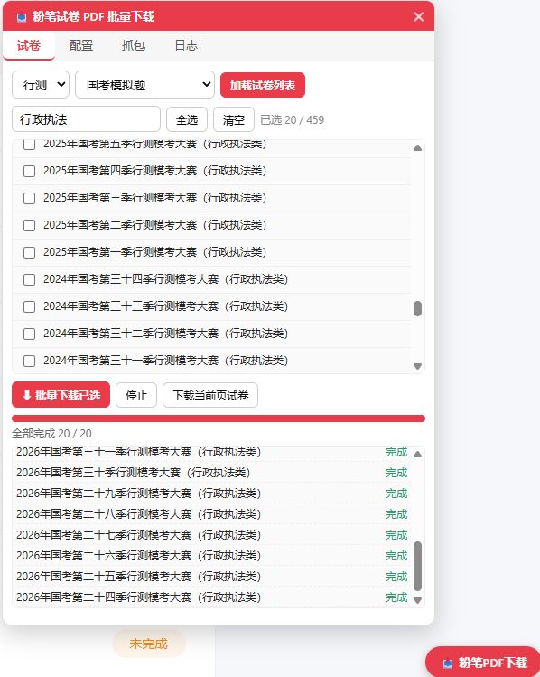

<div align="center">

<h1>申论批改工作区（shenlun-judge）</h1>

**一个申论训练台**：真题原文、我的作答、机构参考答案、批改规范、批改报告，外加一套写进 skill 的评卷口径。

[](LICENSE)
[](https://github.com/ye0619/Shenlun-SKILL)
[](https://github.com/ye0619/Shenlun-SKILL)
[](https://github.com/ye0619/Shenlun-SKILL)

</div>

这是**个人练习工具**，不是考试评分系统。报告里的分数全是"模拟阅卷"出来的，
**不代表官方评分细则**——官方细则和采分表本来就不公开（详见文末《免责声明》）。

---

## 目录

- [作者自述：这个 skill 是怎么来的](#作者自述这个-skill-是怎么来的)
- [项目结构](#项目结构)
- [快速开始](#快速开始)
- [怎么用](#怎么用)
- [省 token 的几个习惯](#省-token-的几个习惯)
- [配套插件：粉笔试卷批量下载](#配套插件粉笔试卷批量下载)
- [目录与命名规范](#目录与命名规范)
- [移植到 Codex、Claude 等平台](#移植到-codexclaude-等平台)
- [脚本](#脚本)
- [这套 skill 的不足](#这套-skill-的不足)
- [更新记录](#更新记录)
- [免责声明](#免责声明)
- [反馈](#反馈)
- [附录：引用说明](#附录引用说明)

---

## 作者自述：这个 skill 是怎么来的

**前排提醒**：由于申论批改是一个巨大的黑箱，没有官方的答案和评分标准，所以只能依靠市面上的参考答案和评分标准模拟评分。所以很可能是在错误的答案上建立的错误标准，批改仅供参考。

我想尽可能去打造一套模板而不是一个确定的评分标准，项目内包含“真题”、“参考答案”、“批改规范”等，你可自行上传，也可以使用你认为可靠的批改规范，你还可以为每套真题自定义批改规范（文件不存在则使用默认），由此达到你认为可靠的批改效果。

**9.19 修改**：受阅卷流程启发——真实阅卷是先抽一批卷试批改，才定下评分标准。所以现在只要你上传了某套题的
参考答案，它批改前会先拿参考答案自己试批一遍、建立一个采分点共识，由此得出参考答案，然后再进行评分。对于大作文，它会先对参考范文进行定档，再拿你的作文和范文对比，不过在ds的评测下范文也只能是二类🤪。


**9.22 修改**：修改给分过高的bug🤪。从网上搜集了几份国考评分规范，据此重写了 skill。
感新月的建议，加进了 **MinerU**（把 pdf、docx、png、jpg 转成 md 的工具，本地也能部署：
https://github.com/opendatalab/MinerU ）。现在口径严格了，但还是很难完全模拟真人阅卷——
毕竟 AI 会把你每个字都过一遍，不漏过任何一个得分点。
同时将09年到26年的国考真题md文件上传。

**9.25 修改**：感谢1591kks的建议，根据他的评分标准进行了完善。

**一些碎碎念**：其实提高批改的准确率有个简单而直接的方法，就是搜集一批考场上的答案以及得分，如果数据足够大，便可以将部分作为训练集、部分作为测试集。但整个工程会耗费大量时间、精力和金钱，个人很难做好，可能机构有能力做吧。
如果你有多考几次的打算，便可以根据自己考场上的作答以及分数，对skill进行调试，但如果真这么做了说明当年没考上😂。

值得一提的是至少批改分数保持了高度一致性，在使用deepseek v4.1flash进行批改时，同一答案多次批改得分一致。在某试卷上deepseek v4.1flash和chatgpt 5.6sol分差在2分以内，这至少说明了skill具有一定约束性。还有就是经过几次修改，单次批改token消耗成功翻倍了😂。

**9.27 修改**：重新删去了字数计入评分。我解释以下原因：为了节省token，以及提高批改准确率，我是建议写完拍照、提取成文档。但这样ai统计字数会出现问题，比如“1.”会是2个字符，但它实际占1个格子；“2025”是4个字符，但实际占2个格子；因为标点不能出现在每行开头，所以和上一行最后一个字放在一个格子，诸如此类。我们可以通过设计一个复杂的计数办法，但会增加消耗的token，结果也可能不如人意。所以我删掉了字数统计，平时大家在格子纸上练习，字数应该会有把控。

此外每次批改完新开对话或有助于省token（未实测，这是ds爬取了几十次批改得出的结论），虽然单对话能让命中率提高，但发送大量上下文会导致额外大量的token消耗，而且是无意义的，在我今天的批改中发送上下文花费了0.76元。

上次修改完发现没有逻辑冲突直接提交了😂。

最后离考试还有两个月，希望大家刷题的同时保持一定运动，用一个良好的健康状态迎接考试。


---

## 项目结构

```text
shenlun/
├── .dsh/skills/shenlun-judge/     # skill 本体：SKILL.md + references/*.md（评卷口径全在这里）
├── 真题/                           # 试卷原题：{省份}/{卷ID}.pdf + 整理好的 {省份}/{卷ID}.md
├── 参考答案/                       # 机构/真题参考答案：{省份}/{卷ID}/第N题.txt
├── 作答记录/                       # 你的作答（只收 md / txt）：{省份}/{卷ID}.txt
├── 批改报告/                       # 报告落盘：{省份}/{卷ID}-批改报告.md（+ 字数核验/共识表/刻度缓存）
├── 批改规范/                       # 某卷（尤其大作文）的批改规范：{省份}/{卷ID}-批改规范.md
├── 工具/                           # 配套脚本：卷面核验.py（整卷字数）、count_chars.py、split_reference.py、ref_independence.py
├── bin/install.js                  # npx 一键安装器
├── templates/workspace/            # 安装时写进新工作区的目录说明模板
├── fenbi-pdf-downloader.user.js    # 配套油猴脚本：粉笔试卷批量下载
└── package.json / README.md / LICENSE / .gitignore
```

**用途**

| 目录 | 放什么 | 谁放 |
|---|---|---|
| `作答记录/` | **你的作答**（批改对象），整卷一份或按题拆，**只收 md / txt** | 你 |
| `参考答案/` | 机构参考答案 / 真题参考答案，一题一文件 | 你收集，助手登记 |
| `批改规范/` | 某套卷的批改规范；批改该卷时**有就必须引用** | 你收集（或用助手试批改的草稿） |
| `批改报告/` | 报告母本；另存字数核验留痕、采分点共识表、大作文刻度缓存 | 助手自动落盘 |
| `真题/` | 原卷 PDF ＋ 整理好的 md（题面与材料是**最高依据**） | 你收集／助手整理 |
| `工具/` | `count_chars.py`、`ref_independence.py` | 随仓库发布，**路径固定，别改名** |
| `.dsh/skills/shenlun-judge/` | skill 本体：`SKILL.md` ＋ `references/` | 本仓库维护 |

> 仓库里**不放个人材料**：`作答记录/`、`批改报告/`、`参考答案/`、`批改规范/` 只上传空框架
> （README ＋ `.gitkeep`），`真题/` 只上传 `国考/*.md`。PDF、个人作答、机构资料都不入库。

---

## 快速开始

### 一键安装（npx）

本仓库自带一个零依赖安装器，一条命令装到任意工作区：

```bash
npx github:ye0619/Shenlun-SKILL          # 从 GitHub 直接装（当前可用）
npx shenlun-skill                        # 发布到 npm 后可用
npx shenlun-skill --dir "D:\my-ws"       # 装到指定工作区（默认当前目录）
npx shenlun-skill --dry-run              # 只打印要做什么，不写盘
npx shenlun-skill --force                # 清空重建 skill 目录（清旧版本残留）
npx shenlun-skill --no-workspace         # 只装 skill，不建材料目录
npx shenlun-skill --help                 # 用法（--version 看版本）
```

装完你会得到：① `.dsh/skills/shenlun-judge/`（skill 本体）；② `工具/`（四个脚本）；
③ 五个材料目录 `真题/ 参考答案/ 作答记录/ 批改报告/ 批改规范/` 及各自的说明 README
（目录已存在就保留，README 已存在就不覆盖）。

装好以后，在支持 skill 的平台里打开这个工作区，直接说一句 `批改 2026河南县级` 就行。

### 克隆仓库手动用

```bash
git clone https://github.com/ye0619/Shenlun-SKILL.git
```

- 省事做法：**直接把这个仓库当工作区用**，材料往五个目录里放。
- 想装到别的工作区：把 `.dsh/skills/shenlun-judge/` 拷到目标工作区 `.dsh/skills/` 下，
  再把 `工具/` 四个脚本拷到目标工作区根目录。
- 注意：`.gitignore` 排除了那五个目录的内容，所以克隆下来它们是**空的**，得自己往里放材料。
  嫌麻烦就用上面的 npx。

### 为什么建议你照抄这套目录结构

1. **一次就能命中**：助手按 `{省份}/{卷ID}` 去五个目录找作答、答案、规范、历史报告；路径一致时一遍找齐。
2. **能自动归位、能横向对比**：命名规范了，报告才会自动登记进 `批改报告/README.md`，
   `-v2`／`-v3` 多稿和同省跨年份的卷子才能放在一起看趋势。
3. **结构乱了也不会崩，就是费来回**：材料散在根目录、名字含糊（`申论.pdf`、`答案.txt`）时，
   助手仍会归位，但要反复问你，token 和耐心都更费。

---

## 怎么用

**① 把材料丢进工作区**（丢根目录就行，不用自己摆）

助手批改前会自动认出**年份／省份／卷型／材料类型**，归到 `{材料类型}/{省份}/{卷ID}…` 并改名，
然后列一份"原路径 → 新路径"清单让你核对；名字含糊时会**先问你**，不擅自决定。

想自己放就按这个来：

- 作答 → `作答记录/{省份}/{卷ID}.txt`（**只收 md / txt**）。图片、扫描件**别放这儿**：
  助手会请你自己先转成文本（OCR 难免字误，字误直接影响采分点判定）；你说"先帮我转"才代转，
  并在报告里注明转写方式、附转写稿请你校对。
- 参考答案 → `参考答案/{省份}/{卷ID}/第N题.txt`，顺手在 `参考答案/README.md` 登记来源与年份。
- 该卷批改规范 → `批改规范/{省份}/`（`{卷ID}-批改规范.md` 或 `{卷ID}-大作文批改规范.md`）。
- 真题原卷 → `真题/{省份}/{卷ID}.pdf`；整理好的题面 → `真题/{省份}/{卷ID}.md`。

**② 说一句话**（越具体越准）

```
批改 2022河南乡镇                     # 助手自己去作答记录里找
批改 .\作答记录\河南\2022河南乡镇.txt   # 直接指文件，最省事
帮我批改这篇大作文，题目是"守正与创新"   # 文本贴在对话里
这道归纳概括我踩到采分点了吗
按这套卷的批改规范给我打分
倡议书格式怎么写  /  大作文立意和分论点怎么搞
展开  /  给我参考范文  /  导出 word
```

**③ 看报告**

每次批改 = 对话里一份精简报告 ＋ 自动落盘 `批改报告/{省份}/{卷ID}-批改报告.md`（重复批改用 `-v2`）。
报告里按这个顺序看：

1. **总分、建议区间和置信度**——分数只是个落点，别把它当结论；
2. **每题采分点核对**（哪些命中、哪些丢，都带原文证据）；
3. **"采分点共识表"**：标出这个点凭什么算分、是共识点还是低权点；
   机构都没写、但材料里确实有、且判定重要的点，**照样计分**，次要的才放"提醒区"；
4. **改进方向**——第一条就是本次最值钱的一条，先改它。

> 报告里还会有一行 **"⚠ 字数提示"**：题面有字数要求时助手会核验你达标没有，**但这一项不扣分**
> （2026-09-27 起字数不计入评分），它只是提醒你考场上的字数风险，压缩建议会一并给。

默认只给精简报告；说"展开／详细"才逐段逐句细评，要"参考范文"才出整篇示范。

---

## 省 token 的几个习惯

同样批一套卷，喂法不同能差好几倍。

**先说实测**（2026-09-27 拿另一段真实批改对话的 365 次请求逐轮对账）：批 9 份卷花 **¥6.87**，
其中 **49% 的钱花在"每一步把整个上下文重发一遍"**（不是读文件贵）；每步平均上下文从第 1 卷的
31k tokens 一路涨到第 9 卷的 **762k**；单卷最贵 ¥1.65，便宜时 ¥0.45。所以**最省的动作是"别让上下文变长"**。

| 习惯 | 为什么 |
|---|---|
| **一卷一会话**（第一优先） | 跨卷批改会让每步上下文翻倍——实测 9 卷时单步 762k tokens。批完一卷就新开对话，成本能压回约 1/3，也彻底避免"上一卷的采分点串到这一卷"；顺手避开上下文塞满后整份重发（每次约 ¥0.78） |
| **每件事只让助手调一次脚本** | 整卷字数用 `工具/卷面核验.py`、拆题用 `工具/split_reference.py`、同源用 `ref_independence.py`。过去一次批改会写十几个临时文件、反复跑脚本再回读，光这一项就多花十几步 |
| **别让助手整读大文件** | `references/` 里有 119 KB 的表；助手应切片查。登记类写入已用 README 锚点，不会为了加一行登记把整份 README 读一遍 |
| **一律用 `.txt` / `.md`** | 同样内容纯文本最省；docx 还得额外解压提取 |
| **图像先自己转文字** | 手写稿、扫描件自己敲一遍，比让模型 OCR 更省更准 |
| **材料放工作区，别贴进对话** | 题干材料放 `真题/`，说个卷ID，助手按需读 |
| **先给卷ID再批** | 一次定位题干、参考答案、规范、历史报告 |
| **一次一套卷或一题** | 一次丢五套＝让模型读五遍 |
| **参考答案整卷丢进目录** | 助手用脚本自动判"同源/独立"，你不用手工标 |
| **大作文只建一次刻度** | 范文梯队建一次缓存，之后只读画像，不重读范文 |
| **小题和大作文分开批** | 大作文最耗 token，不必每轮重跑全卷 |

> 几句提醒：**输出也是钱**（占实测账单的 42%），所以"展开／详细"这类要求本身就在加钱；
> 中间产物（规范、共识表、画像）现在都收敛成"整卷一份"，报告里只留结论，不再复制一遍缓存。

---

## 配套插件：粉笔试卷批量下载

- **位置**：仓库根目录 `fenbi-pdf-downloader.user.js`（油猴单文件脚本）。
  注意 `npx` **不装**这个脚本，要它请克隆仓库。
- **作用**：登录粉笔网页版后批量下载行测／申论试卷 PDF，下载的 PDF 可以直接当
  `真题/{省份}/{卷ID}.pdf` 用。
- **怎么装**：装**篡改猴（Tampermonkey）** → 打开面板"添加新脚本" → 把这个文件的内容粘进去保存
  （或直接把文件拖进浏览器）→ 确认脚本已启用。
- **怎么用**：先登录 `www.fenbi.com`，页面右下角会出现「📥 粉笔PDF下载」，选科目和分类，勾选后批量下载。
- **失效了**：脚本按 2026-08 的粉笔网页版校准；若改版失效，用脚本自带的「抓包」标签页，
  在粉笔页面上正常浏览一次，再点"从抓包记录生成配置"。
- **提醒**：与粉笔官方无关，仅供个人学习自用，请遵守平台条款与版权规定。



---

## 目录与命名规范

五个材料目录**一律按省份分类**，文件统一用**卷ID**命名：**卷ID = `{四位年份}{省份}{卷型}`**
（如 `2022河南乡镇`、`2026国考行政执法`、`2024浙江A`）。

| 材料 | 规范路径 | 备注 |
|---|---|---|
| 作答 | `作答记录/{省份}/{卷ID}.txt` | 只收 md / txt；改稿用 `-v2`、`-v3`，不覆盖旧稿 |
| 参考答案 | `参考答案/{省份}/{卷ID}/第N题.txt` | 一题一文件；在 `参考答案/README.md` 登记来源与年份 |
| 批改规范 | `批改规范/{省份}/{卷ID}-批改规范.md`、`{卷ID}-大作文批改规范.md` | 该卷有就必须引用；自拟可用 `批改规范/_模板.md` |
| 真题原卷 | `真题/{省份}/{卷ID}.pdf` | 题面与材料的最高依据 |
| 真题题面 | `真题/{省份}/{卷ID}.md` | 整理一次长期复用 |
| 批改报告 | `批改报告/{省份}/{卷ID}-批改报告.md` | 助手自动落盘；登记表 `批改报告/README.md` |

- **命名含糊、年份或卷型冲突时，助手会先问你，绝不擅自猜**。
- 五个材料目录的内容不入库（只上传框架），克隆下来是空的。

---

## 移植到 Codex、Claude 等平台

skill 本体就是一堆 md 加四个标准库 Python 脚本，没有平台专属依赖，移植很轻。
思路：**`SKILL.md` 当系统提示挂进去，`references/` 当按需查的资料，`工具/` 当工具。**

**第一步：复制文件**
把 `.dsh/skills/shenlun-judge/` 整个目录拷到目标平台的工作区（目录名随意），
再把工作区根目录的 `工具/` 一并拷过去。（用 npx 也行。）

**第二步：接上入口提示**
按平台约定把主提示放到它认识的位置：

| 平台 | 入口 | 注意 |
|---|---|---|
| **Codex / Codex CLI** | 工作区 `AGENTS.md` | 沙箱默认只写工作区；脚本用 `python` 调；大批改建议分卷 |
| **Claude Code / Claude App** | `CLAUDE.md` 或 Skill 目录 | 长报告注意输出上限，可让报告分节写入再合并 |
| **Cursor / Windsurf** | `.cursor/rules/*.mdc`、`.windsurfrules` | 适合边写边批；长材料挤上下文，建议一次一题 |
| **ChatGPT 网页** | 首条消息粘 `SKILL.md` | 没有文件系统 → 字数只能估，**禁止标精确字数** |
| **纯本地脚本** | 任意 shell | 只需 `python`，无第三方依赖 |

入口提示写一句就够：**读 `skills/shenlun-judge/SKILL.md`，严格按其执行；输出必须带评分依据声明、
建议区间与置信度。**

**第三步：说明目录约定**
告诉它工作区里五个目录各是什么、卷ID 怎么组——本 README 的《目录与命名规范》可以直接当这段说明。

**移植时必须保住这六条（否则 skill 会退化）**

1. **题面要求最高**：L1（题干、大纲、考场规则）优先；模拟口径与参考口径必须标注"非官方"，
   不得说成官方标准。该卷有 `批改规范/` 就必须引用。
2. **不把参考答案当你的作答**：找不到作答就明说找不到，不许编、不许拿范文冒充。
3. **给分必须带建议区间和置信度**，不能只甩一个精确到小数点的数字。
4. **字数：核验是硬要求，但不计入评分**——示例答案／范文必须跑字数核验（并落在 85%–95%）；
   你的作答**只判"合不合题干要求"**（"不超过 XX"＝上限 XX；"XX 字左右"＝XX±50），
   超限/偏少只在报告里单列一句"⚠ 字数提示"，**不扣分、不降档、不进任何分值**；压缩建议照给。
   别自创扣分公式（`⌈超出达标上限 ÷ 50⌉` 那套已于 2026-09-27 废止）。
5. **大作文走"档位锚定 + 硬伤修正 + 档内定位"**，并保住三条禁令：
   同义表达与异构论证一律允许、具体案例不是采分点、"立意稍微模糊"不是硬伤。
6. **四条最容易被新版丢掉的用户口径**（改版／移植时务必一并搬走，否则口径会丢）：
   **① 字数不计入评分**——题干要求须核验，但超限/偏少只提示，不扣分、不降档；
   **② 数据与口语化表达不属采分点**（数字、月份、数量、百分比、口号式语句缺失不扣分）；
   **③ 列举式带"等"的**（≥2 项）**任选一项即完整命中**，不必是第一项；
   **④ 采分点粒度按题型分化**——分析题从严（单点 ≤ 总分 15%），概括题·对策题从宽
   （单点 ≤ 总分 30%），公文维持 80/10/10。

---

## 脚本

四个 Python 3 标准库脚本，各带 `--selftest`：

- **`工具/卷面核验.py`**（**整卷字数一次过**——批改用户作答就用它）
  ```bash
  python 工具/卷面核验.py 作答记录/浙江/2019浙江A.txt --spec "1:300,2:300,3:300,4:approx1000"
  python 工具/卷面核验.py 作答.txt --spec "1:300,2:approx1000,3:1000-1200,4:min800" --md out.md
  python 工具/卷面核验.py --selftest
  ```
  一次出 ASCII 表格（控制台不会乱码），`--md` 直接写出报告用的中文块。
  `--spec` 语法：`N:300`＝不超过、`N:approx1000`＝1000 字左右（**±50**）、`N:1000-1200`＝区间、`N:min800`＝不少于。
  **字数不计入评分**（2026-09-27）：超限只作提示，不扣分、不降档。
- **`工具/count_chars.py`**（单块字数，答题卡口径：含标点、不含空格换行）
  ```bash
  python 工具/count_chars.py 答案.txt --limit 300            # 示例答案
  python 工具/count_chars.py 作文.txt --limit 1000 --approx  # "1000 字左右"（±50）
  python 工具/count_chars.py --selftest
  ```
  它和 Word 的字数统计不完全一致，报告统一以脚本值为准，别拿两个数字对比。
- **`工具/split_reference.py`**（**参考答案汇总件按题拆分**）
  ```bash
  python 工具/split_reference.py "参考答案/浙江/2026浙江B/.原始件/x.md" --outdir "参考答案/浙江/2026浙江B" --dry-run
  ```
  只新增、正文一字不改、不动源件；已存在默认跳过。**别再为拆题现写临时脚本**。
- **`工具/ref_independence.py`**（参考答案同源检测）：机构之间互相转抄很常见，
  所以"独立来源家数 = 分组数，不是文件数"；`--same 0.80` 判同源转抄，`--near 0.60` 判疑似同源。
  注意：**给分不用文本相似度**，这个脚本只用于参考答案之间判同源。
- **PDF 提取**（可选）：`python` + PyMuPDF（`import fitz`）。失败就换平台自带的 PDF／OCR 能力，并人工校对。
- **省 token 纪律**：每件事**只调一次**——整卷字数用 `卷面核验.py`、拆题用 `split_reference.py`、
  家数用 `ref_independence.py`；不写临时 `_*.txt` 再回读、不为一次性任务现写脚本、不整篇读大的 `references/`。

---

## 这套 skill 的不足

用之前请知道：

1. **没有官方标准可依**。官方阅卷细则与采分表通常不公开，档位区间、采分点拆分、扣分量级
   全是自建口径。它能保证"同一个人前后两次尺度一致"，**不能保证和考场给分一致**。
2. **分数是区间不是点**。主分只是落点，真正有用的是"建议区间 ＋ 置信度"。
3. **小题采分点可能重构偏差**。采分点是从材料里模拟拆的，与命题人的真实采分表可能多、少或错位；
   有参考答案的卷靠多口径交集纠偏，没有的偏差更大。
4. **公文三池比例没有官方依据**。内容/格式/语言各占多少分，官方从未公布，报告里的比例只是训练参照。
5. **大作文的"深刻""充实"仍是判断**。四维描述能对齐尺度，但不同判断者之间仍有 ±2 分左右的漂移——
   这也是建议区间存在的原因。
6. **反模板做得激进**。好处是不会因为没写五段三分被冤扣，代价是对"结构漂亮但内容空"的文章给分偏软。
7. **范文刻度是循环校准**。梯队参照档是同一个模型用同一套规则判出来的，只能当相对标尺，
   冲突时以题面＋四维实际表现为准。
8. **依赖你自己投喂材料**。`作答记录/`、`参考答案/`、`批改规范/` 都得你放；
   覆盖率不足的年份和卷型只能纯模拟，置信度上不去。
9. **PDF 提取有坑**。部分真题 PDF 文字层会乱码，需要换方式或 OCR，并人工校对。
10. **不会替你写整篇**。默认只给方向、采分点、示例答案（小题）与改进建议；要整篇范文得明确说。
11. **只覆盖申论**。行测、面试不在范围内。
12. **真题库要自己建**。题库不随 skill 分发，放在 `真题/{省份}/{卷ID}.md`；新环境默认没有，
    识别与匹配能力取决于你是否整理过。

---

## 更新记录

| 日期 | 内容 |
|---|---|
| **2026-09-27** | **① 全盘修改：字数不计入评分**。你的作答字数从此**只核验、只在报告里单列一句提示**（"超出题干上限 X 字（按用户口径不计分）"），**不扣分、不降档、不进任何分值**；压缩建议照给。**"X 字左右"仍是 ±50 判达标**，但**只用来判"合不合题干要求"，不再折算分数**；⛔ 废止 2026-09-21／09-25 那套 `⌈超出达标上限 ÷ 50⌉`。示例答案／范文的 85%–95% 硬约束不变。**② 按实测账单做省 token 改造**（拿另一段批改对话的 365 次请求逐轮核对）：新增 `工具/卷面核验.py`（整卷字数一次过）与 `工具/split_reference.py`（汇总件拆题），**一卷一会话**写成硬规则（`session-isolation.md` R6），登记改用 README 锚点、禁止整读，共识表整卷合并 1 份、画像不再抄进报告，并堵上"大作文从没读过 `essay-judging.md`"的漏洞。实测基准：9 卷 ¥6.87，其中 cacheRead 占 46.6%、output 41.8%。**③ 按《冲突检测报告-2026-09-27》清理 2 处表述残留**：`essay-judging.md` 里唯一一处还把字数说成"计分"的引言已改；"未写标题只提示不扣分"补上**题型限定**——只管**大作文/小题**，**公文标题是格式要素、缺标题走格式池 −1**（报告只点出 1 处，实际同类表述有 4 处，已一并补齐）。判分算法未变。 |
| **2026-09-25** | 按《申论批改skill-规则变更说明-20260925》落地 12 条规则改动：~~**字数开始扣分**~~（**⛔ 该条已于 2026-09-27 废止**）；**数据和口语化表达不算采分点**（缺失不扣）；**列举式带"等"的，任选一项即算完整命中**；**提纲格式按题区分**（只有发言提纲要"标题＋称谓"，其余有标题即满格式分，提纲一律不要落款）；**采分点粒度按题型分化**（分析题从严、单点 ≤15%，概括题·对策题从宽、单点 ≤30%，公文维持 80/10/10）——粒度用两套真实判分卷反向校准过。 |
| **2026-09-23** | 又清了两轮文件之间的口径冲突：大作文档内定位门槛统一（**上＝≥4 项达上沿、中＝≥3 项达中位**）、"泛泛表述"统一为 0 分、旧"0 家＝不计分"的残留说法全部改掉、三份分发模板同步；并裁定"题目明示不考虑格式 = 本题没有格式分"。 |
| **2026-09-22** | **内置国考默认批改标准**（国考直接用，河南/浙江套用并做总分适配）；**格式与语言给分占比下调**（公文改为内容 80%／格式 10%／语言 10%）；**新增"从紧给分"**（部分命中就低不就高、泛泛表述 0 分，**但你多写的内容一律不扣分**）；**机构没写但材料确凿且重要的点，按弱共识计分**；加入 **MinerU** 流程（遇到 pdf/docx/图片先问你要不要转 md）；`.gitignore` 改为只上传五个目录的框架 ＋ `真题/国考/*.md`。 |
| **2026-09-19 及之前** | 两阶段流程（先试批改标定、再批改你的答卷）；采分点共识模型（按机构共识定权重）；大作文改成"档位锚定 + 硬伤修正 + 档内定位"；范文梯队刻度；卷级隔离与材料自动归位。 |

---

## 免责声明

- 本项目是**个人申论训练工具**，与任何考试主管机构、命题机构、培训机构**无隶属或合作关系**。
- **不提供也不掌握官方阅卷细则与采分表**；所有分数、档位、采分点均为模拟与参考口径，
  **不构成对真实考试成绩的预测或承诺**，请勿据单一分数做重大决策。
- 报告由 AI 生成，**可能有事实错误、遗漏或判断偏差**；请以官方公告、大纲与真题原文为准
  （题面要求始终优先于本工作区的一切模拟口径）。
- 请自行负责所上传材料的**合法性与隐私**，勿上传涉密或他人隐私材料。
- 软件按"现状"提供，不附带任何担保；使用后果由使用者自行承担。

---

## 反馈

- 有想法欢迎提 [Issue](https://github.com/ye0619/Shenlun-SKILL/issues)：报错、改进建议、
  或者干脆贴一段批改报告——**评分尺度的宽严就是靠这些反馈一点点校准的**。
  仓库自带[反馈模板](.github/ISSUE_TEMPLATE/feedback.md)，会提醒你填卷ID、题型、分值字数、
  材料是否齐全、期望 vs 实际，材料越全越好定位。
- 如果你手上有某卷的批改规范，欢迎放进 `批改规范/{省份}/`，下次批改就会自动引用。
- 口径每次调整都会记进 `references/scoring-standards.md` 的修订记录；
  引用旧报告时记得带上"卷ID ＋ 版本（v1/v2）＋ 批改日期"，别和新口径混着比。
- 觉得有用就点个 ⭐。

---

## 附录：引用说明

对外引用、二次整理或喂给别的模型时，请守住这几条：

1. **分清引用对象**：题面与材料来自官方真题，可以当依据引用；
   而**档位区间、采分点、分值、扣分量级**必须写"据 shenlun-judge 模拟阅卷模型（经验口径，非官方）"，
   **不得写成"官方评分标准""官方采分点"**。引用 `参考答案/` 的机构解析标"参考口径（非官方）"；
   引用 `批改规范/` 时写明来源（官方公开／机构／自拟）。
2. **不得反向冒充**：不要把本工作区生成的报告、示例答案、范文说成"官方答案""标准答案""阅卷细则原文"。
3. **尊重他人版权**：`参考答案/` 里的机构解析、名师范文版权归各机构／作者，仅供个人学习研究，
   请勿二次分发或商用；真题 PDF 版权归命题机构。
4. **留好追溯信息**：引用结论时带上"卷ID ＋ 报告版本（v1/v2） ＋ 批改日期"——
   口径会随迭代变化，**旧报告不要直接和新报告比分数**。

---

*评卷口径以 `.dsh/skills/shenlun-judge/SKILL.md` 与 `references/` 为准；本 README 只是使用说明，如有冲突以 skill 正文为准。*
